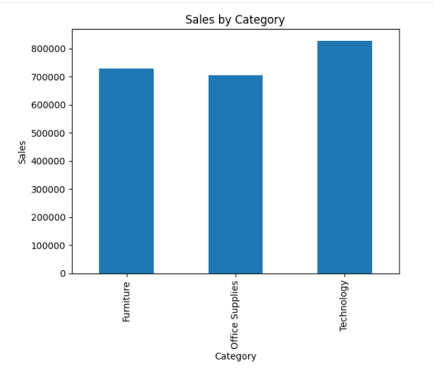
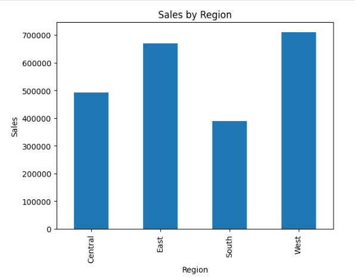
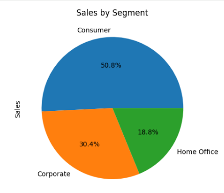
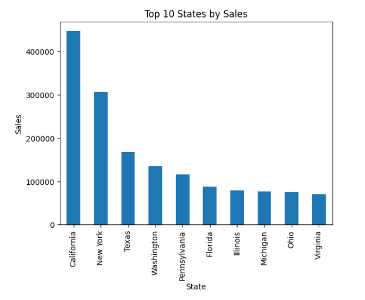
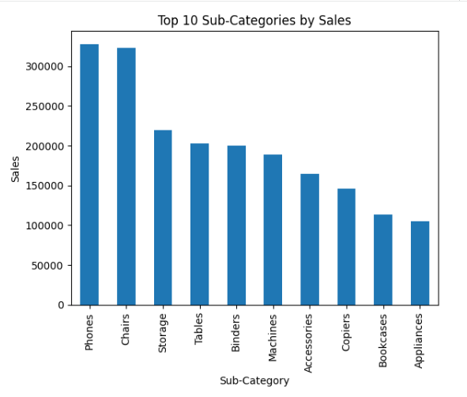
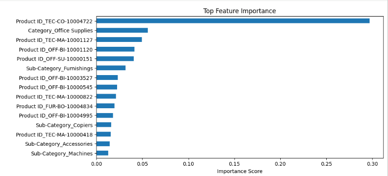

# 🛒 Retail Sales Analytics and Sales Forecasting using Machine Learning

## 📌 Project Overview

This project focuses on analyzing retail sales data to uncover valuable business insights and develop a machine learning model capable of forecasting sales performance.

The project follows a complete Data Science workflow including:

- Data Collection
- Data Cleaning
- Exploratory Data Analysis (EDA)
- Data Visualization
- Feature Engineering
- Machine Learning Model Development
- Model Evaluation
- Feature Importance Analysis

The goal is to help businesses understand sales patterns and identify factors that significantly influence revenue generation.

---

## 🎯 Business Objectives

The project aims to answer the following business questions:

1. Which product categories generate the highest sales?
2. Which regions contribute the most revenue?
3. Which customer segments drive sales growth?
4. Which states generate the highest sales?
5. Which sub-categories contribute most to total revenue?
6. Can machine learning be used to predict future sales performance?

---

## 🛠️ Technologies Used

- Python
- Pandas
- NumPy
- Matplotlib
- Scikit-Learn
- Google Colab

---

## 📂 Dataset Information

| Attribute | Value |
|------------|------------|
| Dataset Type | Retail Sales Dataset |
| Total Records | 9,800 |
| Total Features | 18 |
| Target Variable | Sales |

### Important Features

- Category
- Sub-Category
- Region
- State
- Segment
- Ship Mode
- Product Information
- Customer Information
- Sales

---

# 🔍 Exploratory Data Analysis

The dataset was explored to identify trends, customer behavior, and revenue-generating patterns.

---

## 📊 Sales by Category

Technology products generated the highest sales among all categories, indicating strong customer demand.

### Screenshot

>
> `images/category_sales.png`



---

## 🌎 Sales by Region

The West region generated the highest overall revenue, while the South region contributed the least.

### Screenshot

>
> `images/region_sales.png`



---

## 👥 Customer Segment Analysis

The Consumer segment accounted for more than 50% of total sales, making it the most important customer segment.

### Screenshot

>
> `images/segment_sales.png`



---

## 🏆 Top States by Sales

California emerged as the highest revenue-generating state, followed by New York and Texas.

### Screenshot

>
> `images/top_states.png`



---

## 📦 Top Revenue Generating Sub-Categories

A small number of sub-categories contribute a significant proportion of overall revenue.

Top-performing sub-categories include:

- Phones
- Chairs
- Storage
- Tables
- Binders

### Screenshot

>
> `images/subcategory_sales.png`



---

# ⚙️ Data Preprocessing

Several preprocessing steps were performed before training the machine learning model.

### Missing Value Handling

- Dataset contained only 11 missing values in Postal Code.
- No significant missing values were found in other features.

### Feature Engineering

New features were extracted from the Order Date column:

- Order Month
- Order Quarter
- Order Year
- Order Day
- Order Weekday

### Encoding

Categorical variables were converted into numerical format using Label Encoding.

Encoded Features:

- Category
- Sub-Category
- Region
- Segment
- State
- Ship Mode
- Customer ID
- Product ID
- Product Name
- City

---

# 🤖 Machine Learning Model

## Model Used

Random Forest Regressor

Random Forest was selected because:

- It handles non-linear relationships effectively.
- It is robust against overfitting.
- It works well with mixed feature types.
- It provides feature importance analysis.

---

## Features Used

### Input Features

- Category
- Sub-Category
- Region
- Segment
- Ship Mode
- State
- Order Month
- Order Quarter
- Order Year

### Target Variable

Sales

---

# 📈 Model Performance

The model was evaluated using standard regression metrics.

| Metric | Score |
|----------|----------|
| R² Score | 0.27 |
| Mean Absolute Error (MAE) | 205.11 |

### Interpretation

- The model captures meaningful sales patterns.
- Feature importance analysis indicates that product and category information significantly affect sales.
- Further performance improvements can be achieved through advanced feature engineering and hyperparameter tuning.

---

# 🎯 Feature Importance Analysis

The Random Forest model identified the most influential features affecting sales prediction.

Top important features include:

- Product ID
- Category
- Sub-Category
- Region
- Product Information

### Screenshot


>
> `images/feature_importance.png`



---

# 💡 Key Business Insights

✅ Technology category generated the highest overall sales.

✅ West region contributed the highest revenue among all regions.

✅ Consumer customers accounted for more than half of total sales.

✅ California emerged as the strongest performing state.

✅ Phones and Chairs were among the most profitable sub-categories.

✅ Product-related features significantly influence sales prediction.

---

# 📁 Project Structure

```text
sales-forecasting-ml/
│
├── images/
│   ├── category_sales.png
│   ├── region_sales.png
│   ├── segment_sales.png
│   ├── top_states.png
│   ├── subcategory_sales.png
│   └── feature_importance.png
│
├── Retail_Sales_Analytics_and_Forecasting.ipynb
├── sales.csv
└── README.md
```

---

# 🚀 Future Improvements

Future enhancements for this project include:

- Hyperparameter Optimization
- XGBoost Regression
- LightGBM Regression
- Time Series Forecasting
- Interactive Dashboard using Streamlit
- Deployment as a Web Application
- Real-Time Sales Forecasting

---

# 👩‍💻 Author

### Vanshika Sharma

B.Tech Computer Science Engineering Student

Interested in:

- Machine Learning
- Data Science
- Artificial Intelligence
- Analytics

GitHub:
https://github.com/vanshika-2909

---

## ⭐ If you found this project useful, consider giving it a star on GitHub.
